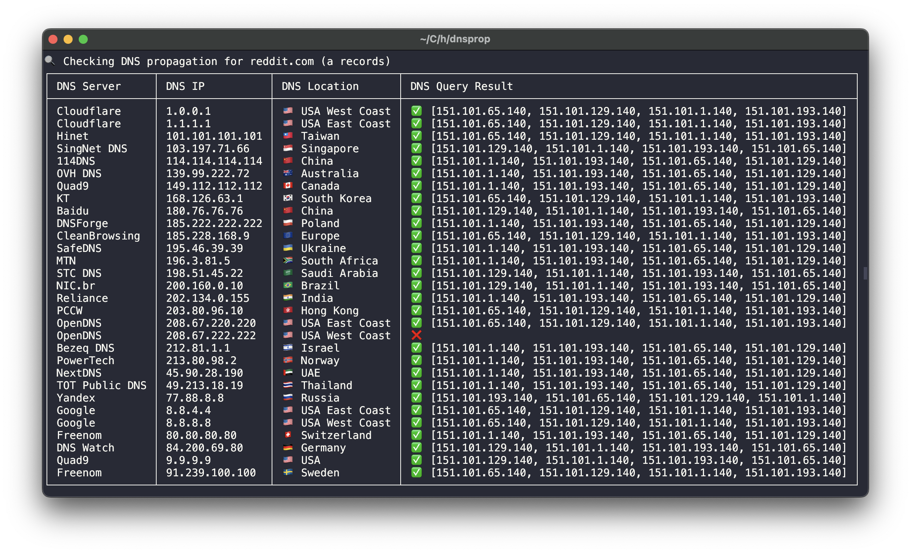

# dnsprop

## Overview
This cmd tool allows you to check DNS propagation by querying multiple public DNS servers around the world. It supports various DNS record types, such as A, AAAA, CNAME, MX, and TXT.

Screenshot:


## Installation
### Prerequisites
Ensure you have Go installed on your system. If you haven't installed Go, download and install it from [Go's official website](https://go.dev/dl/).

### Steps to Install
1. Install the package using `go install`:
   ```sh
   go install github.com/hamochi/dnsprop@latest
   ```
2. Ensure that `$GOPATH/bin` is in your system's `PATH` to run the binary globally.

## Usage
### Basic Usage
Run the tool with a domain name:
```sh
./dnsprop example.com
```
By default, it will check for `A` records.

### Specify Record Type
To query a specific record type, provide it as an argument:
```sh
./dnsprop A example.com
./dnsprop MX example.com
./dnsprop TXT example.com
```

### Output Format
The tool displays results in a tabular format, listing DNS servers, locations, record types, and results.

## Running Tests
To run tests for the lookup function, use:
```sh
go test -v
```

## Contributing
Feel free to submit pull requests or open issues for improvements.

## License
This project is licensed under the MIT License.

